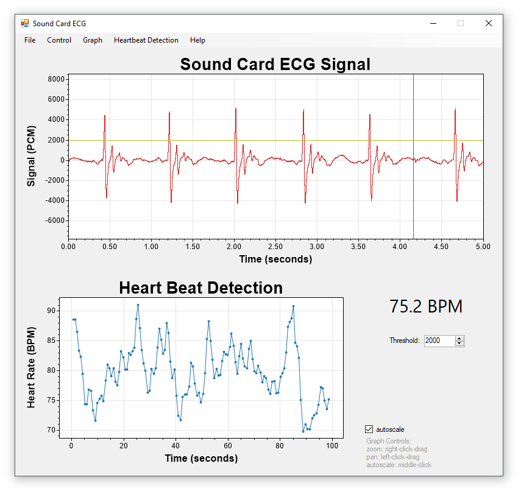
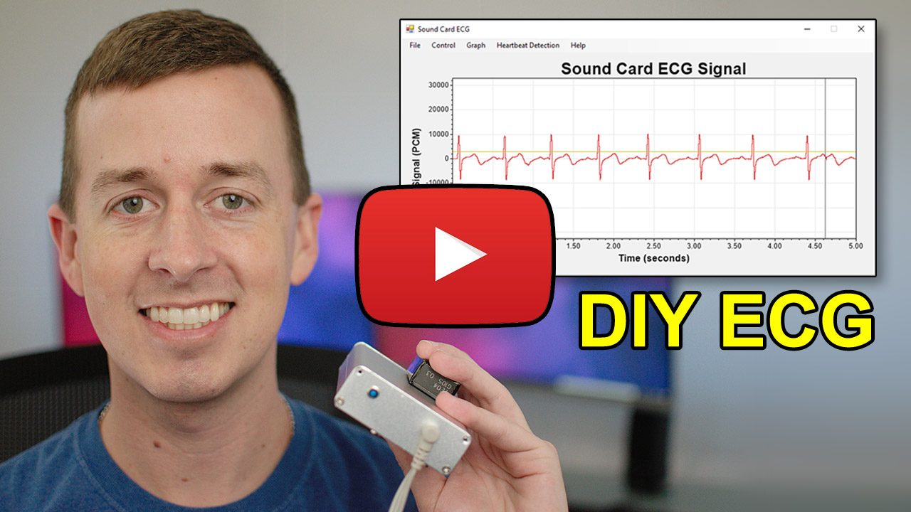
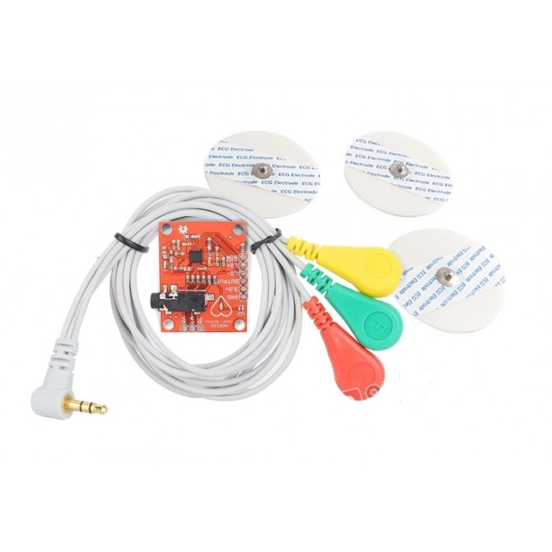
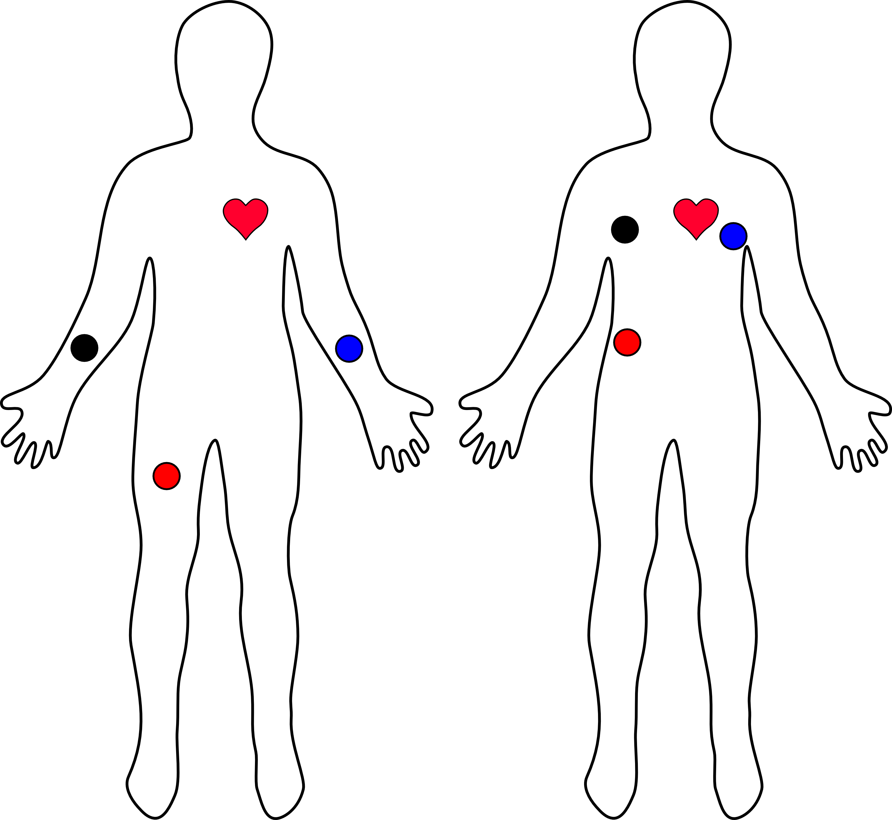

# Sound Card ECG
The **Sound Card ECG** program provides a simple interface to view and measure ECG signals obtained through the sound card (using a line-in or microphone jack).

Screenshot | Video Demonstration
---|---
 | 

The screenshot shows my heartbeat rate as I comfortably used the computer, then took a few minutes to watch a scary video (which elevated my heartrate for a few minutes in the middle).

### Download
A click-to-run EXE is available: **[SoundCardECG.zip](https://raw.githubusercontent.com/swharden/SoundCardECG/master/download/SoundCardECG.zip)**

### Hardware Notes

Notes | Image
---|---
**AD8232 ECG Module**: My preferred ECG device (and the one I used in the screenshot) is a [AD8232](https://www.analog.com/media/en/technical-documentation/data-sheets/ad8232.pdf) breakout board ([SparkFun](https://www.sparkfun.com/products/12650)) feeding the signal directly into the microphone jack of my PC. | 
**Lead Placement**: The AD8232 works best if leads are placed in one of these configurations | 
**DIY ECG with 1 Op-Amp**: Those interested in building an ECG circuit from scratch may find my [DIY ECG with a Single Op-Amp](https://github.com/swharden/diyECG-1opAmp) (an LM-741) project interesting. | 
